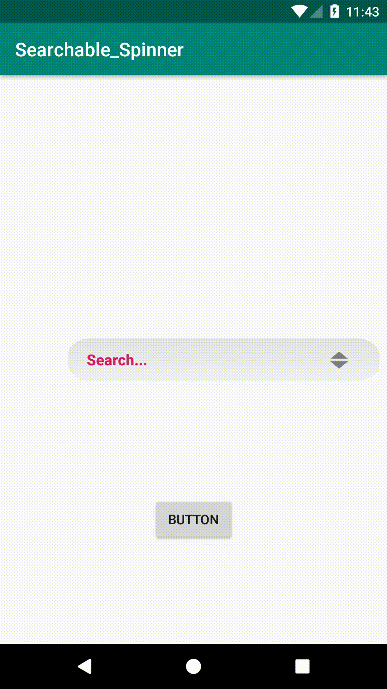

# Material_Searchable_Spinner



## How to use:

```
allprojects {
		repositories {
			...
			maven { url 'https://jitpack.io' }
		}
	}
  ```
  
```  
  dependencies {
	        implementation 'com.github.tareq3:Material_Searchable_Spinner:1.3'
	}
  
 ```
 
  ### Step for Initialization:
  ## XML:
  ```
    <com.mti.searchable_spinner_ext.SearchableSpinner
        android:id="@+id/searchableSpinner"
        android:layout_width="0dp"
        android:layout_height="wrap_content"
        android:layout_marginStart="72dp"
        android:layout_marginLeft="72dp"
        android:layout_marginEnd="8dp"
        android:layout_marginRight="8dp"
        app:hintText="Search..."
        app:layout_constraintBottom_toBottomOf="parent"
        app:layout_constraintEnd_toEndOf="parent"
        app:layout_constraintStart_toStartOf="parent"
        app:layout_constraintTop_toTopOf="parent">
  
  ```
    
   ## JAVA:
     
     ```
    //member variables
    ArrayList<String> mArrayList=new ArrayList<>(Arrays.asList("Red_Apple","Green_Apple","Yellow_Banana"   ));
    SearchableSpinner    searchableSpinner;
    
    
    // Init
      searchableSpinner  = findViewById(R.id.searchableSpinner);
      searchableSpinner.setTitle("Category",ResourcesCompat.getColor(getResources(), R.color.colorAccent, null)); //without theme);
      searchableSpinner.setArrayList_String(mArrayList);


    //getting selected item res 
     String slect = searchableSpinner.getSelectedItem().toString();

               int pos=searchableSpinner.getSelectedItemPosition();

                  Toast.makeText(MainActivity.this, pos+ "" + slect, Toast.LENGTH_SHORT).show();  
    ```
    
    
   # Customization of color:
    
   ### add this color in your color file then change the color code
  
  ```
  //Just Add this color for changing default Item color and ItemColor
    <color name="serchable_itemDef"> #000000</color>
    <color name="searchable_item">#FFFFFF</color>
    
   ```
   
  ### Set Custom BackGround in Spinner:-
  ```
  searchableSpinner.setCusBackground(null); //for default background
  searchableSpinner.setCusBackground(getResources().getDrawable(R.drawable.ss_searchview)); //for custom background
  
